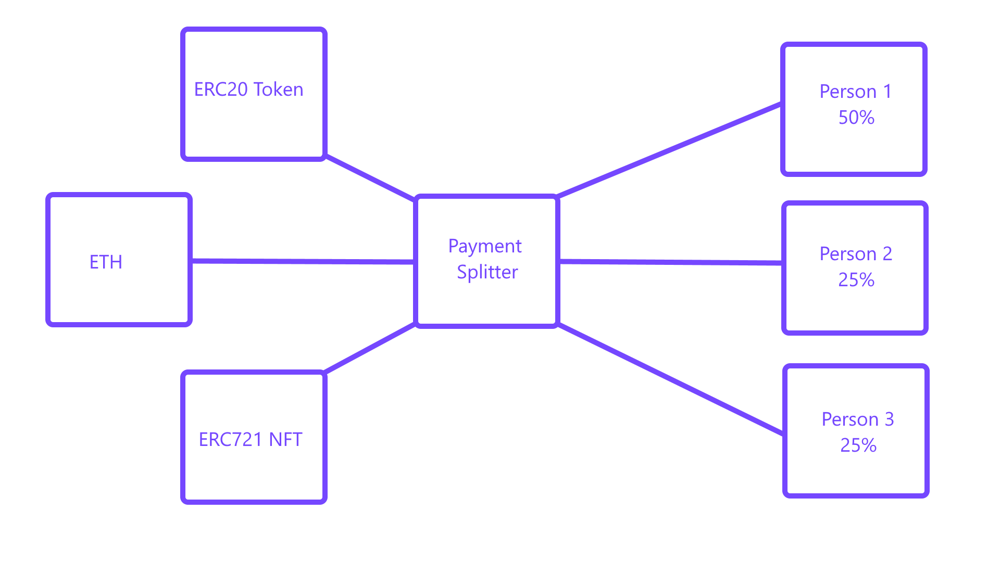

# Payment Splitter with NFT integration.

Folders: Web, Contracts

Contracts contains all solidity contracts, and deploy scripts.
Web contains the react frontend to interact with this contract.

To get startet go to the WebApp folder.

# How does the Payment Splitter work?

The contract takes in all types of ERC20 and ERC721 Tokens. 
It distributes them according to predefined amount of shares to predefined amount of wallets.

Example:

We have Person 1, Person 2 and Person 3. They made an NFT collection together, and decided to pay themself in ETH and NFTs.

Now they want to split the Team allocation according to their share. This contract allows them to do so, with little effort.

